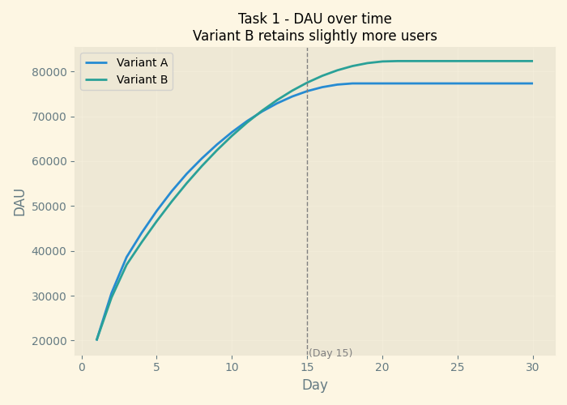
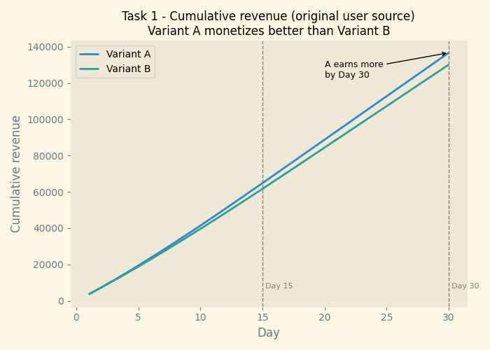
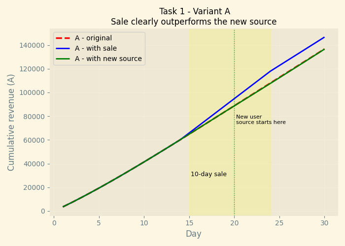
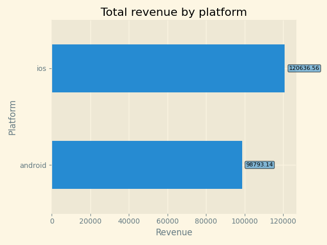
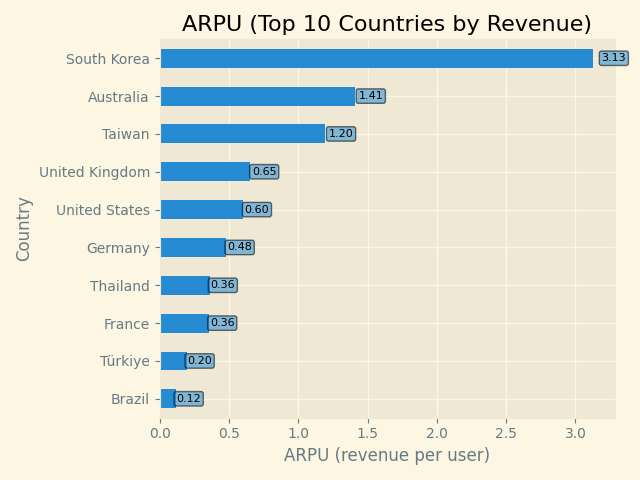
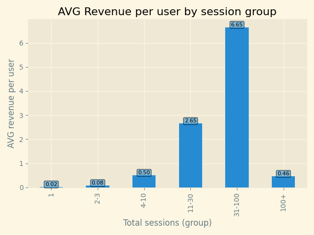
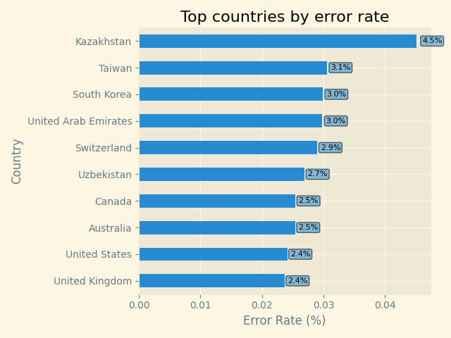
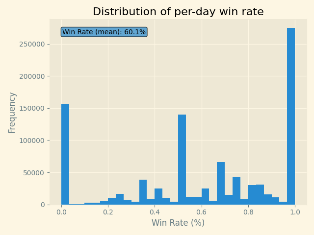
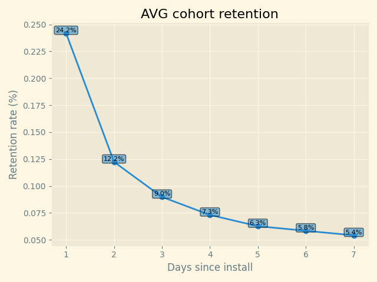

# Vertigo Games – Data Analyst Case Study

This case study evaluates difficulty-flow variants through simulation (Task 1) and analyzes real gameplay data for retention, monetization, and engagement insights (Task 2). The entire analysis is reproducible using the scripts provided in the /src directory.

Rather than presenting the results as separate code outputs, this README.md summarizes all the data, findings and visualizations in one place.

Before starting, here are the user IDs for both of my Game Accounts as requested:
- lemmy187: 583AC57F031328E2 - Polygun Arena
- [TRK]lemmy187: A7C0E920FA897207 - Critical Strike

---

## Task 1 – A/B Test Simulation

#### Overview
The first task focuses on understanding how Variant A and Variant B perform across a 30-day window.
Each variant receives 20,000 daily installs, and the effects of retention, monetization, and potential improvements (a temporary sale or new user source) are evaluated.

##### Methodology
- Simulated 30 days of player behavior for Variant A and Variant B.  
 Each variant receives 20,000 installs per day.
- Retention is reviewed from D1, D3, D7, D14.  
- Revenue is calculated using purchase probability, ARPPU, ad impressions, and eCPM.

Two additional scenarios were analyzed:
- 10-day sale starting Day 15 (+1% absolute purchase rate)
- New user source added on Day 20 with its own retention curve

All simulation logic is in `src/ab_test_task_1.py`.

---

#### a. DAU Comparison  
The retention patterns show that Variant B holds users slightly better beyond the first few days.
As a result, by Day 15, B has a higher DAU.

---

#### b + c. Cumulative Revenue (original user source) 
Despite B having higher Daily Active Users, Variant A generates more revenue by Day 15.

This comes from:

- Higher purchase probability
- More ad impressions per user
- Stronger In-App-Purchases + Ad monetization per user

The advantage of Variant A widens across the month at Day 30 mark.
Retention alone isn’t enough to close the monetization gap.

---

#### d + e + f. Sale Boost and new user source and Conclusion
Introducing a temporary sale improves revenue for both variants but does not change the ranking.
Variant A continues to outperform B under identical sale conditions.

A new source of installs (starting Day 20) increases volume but has weaker retention than the original cohorts.
Both variants earn slightly less total revenue under this setup. Variant A still leads.

We should prioritize the temporary sale as the sale provides a direct, immediate uplift in revenue without negatively affecting retention.
Even though it lasts only 10 days, it generates a larger incremental gain than adding the new user source.

In contrast, the new user source:

- brings additional volume
- but has weaker retention,
- which reduces long-term engagement and lowers total revenue compared to the original user source.

  

---

#### Task 1 Conclusion
- More DAU at Day 15 → **Variant B**  
- More revenue at Day 15 → **Variant A**  
- More revenue at Day 30 → **Variant A**  
- If only one improvement is allowed → **Run the 10-day sale**  
- Best overall variant → **Variant A**

---

## Task 2 – Player Data Analysis

The purpose of this task was to analyze the provided raw dataset containing user info to understand player engagement, retention, monetization behavior, and potential friction points.

##### Methodology
- Loaded and combined all .csv.gz event files.
- Processed datetimes and created days_since_install.
- Aggregated user-level totals (sessions, session duration, revenue).
- Calculated win rate, payer status, and error rate.
- Generated platform and country comparisons.
- Built simple retention curves (D1–D7).
- Looked for behavioral or technical friction indicators.

All analysis is in `src/task_2_analysis.py`.

---

#### Platform Revenue  
iOS users have higher ARPU and higher payer share.
Android users generate higher volume but lower spend per user.

---

#### Country ARPU  
A handful of markets drive most revenue.
Some mid-sized markets generate relatively high ARPU and may represent growth opportunities.

Top 3 Growth Opportunities:

These three countries combine strong ARPU and scalable player bases, making them the most practical growth opportunities in the dataset.

1. Australia: Very high ARPU (1.41), smaller volume but strong spending behavior, good ROI for targeted campaigns
2. Taiwan: High ARPU (1.20), strong engagement patterns
3. Germany: Good size and decent ARPU, opportunity to grow via localized onboarding and offers

---

#### Revenue by Session Count  
There is a strong link between session count and revenue.
Players typically start monetizing after reaching around 10 total sessions.
Players with 30+ sessions account for most monetization.

---

#### Error Rates  
Certain regions experience disproportionately high server error rates.
Addressing these could directly improve retention and engagement.

---

#### Win Rate Distribution  
The distribution of win rates is centered near 50%, but some cohorts show significantly lower values, potentially pointing to difficulty spikes or matchmaking imbalances.

---

#### Early Retention (D1–D7)  
Retention drops sharply from D1 to D2, then continues to decline more gradually.
The largest retention loss happens after the installation.

---

## Summary
Task 1 shows that Variant A is the better monetization choice, even though Variant B maintains slightly higher DAU.

Task 2 highlights several areas where improving the early-game experience and addressing technical issues could meaningfully improve player retention and long-term revenue.

